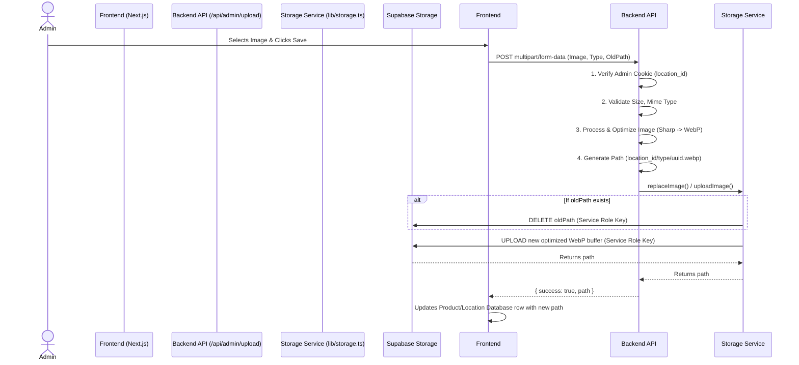

# The 2AM Club - System Architecture

This document outlines the core architecture of The 2AM Club, specifically focusing on the multi-tenant location model and the secure storage subsystem.

## Core Architecture
The platform is designed to support multiple locations (e.g., different hostel blocks, different campuses). It does NOT use standard Supabase Auth (Email/Password) for admins. Instead, it uses a highly streamlined, custom `admin_code` authentication system.

- **Global Entities:** `locations`
- **Scoped Entities:** `products`, `orders`, `order_items` (all strictly belong to a specific `location_id`)
- **Authentication:** Admin logins are verified against the `admin_code` column in the `locations` table. A secure, HttpOnly cookie (`adminAuth`) is set containing the `location_id`.

## Storage Subsystem (Secure Production Mode)

To ensure high security without traditional Supabase Auth, the storage architecture completely isolates the public frontend from direct upload/delete access.

### Security Principles:
1. **Public Read-Only:** The `product-images` bucket only allows `SELECT` operations. No `INSERT/UPDATE/DELETE` policies exist for the public.
2. **Server-Side Uploads:** All uploads are routed through a Next.js Server API (`/api/admin/upload`).
3. **Session Verification:** The API strictly verifies the `adminAuth` cookie.
4. **Service Role Bypass:** The API uses the `SUPABASE_SERVICE_ROLE_KEY` to securely bypass RLS and upload the optimized image directly into the bucket.
5. **Image Optimization:** All uploaded images are processed using `sharp` (Max 1600px, WebP format, Max size 2MB).

### Upload Sequence Diagram

## Idempotent Database Initialization

The database is initialized via `supabase/schema_v3.sql`. This script is built using defensive PL/pgSQL `DO` blocks. 
- It can be run repeatedly without causing duplication errors.
- It automatically verifies the existence of the Storage extension and creates the `product-images` bucket.
- It applies the Read-Only policy to the bucket securely.
- It prints a verbose verification summary to the Supabase SQL Editor console upon completion.
