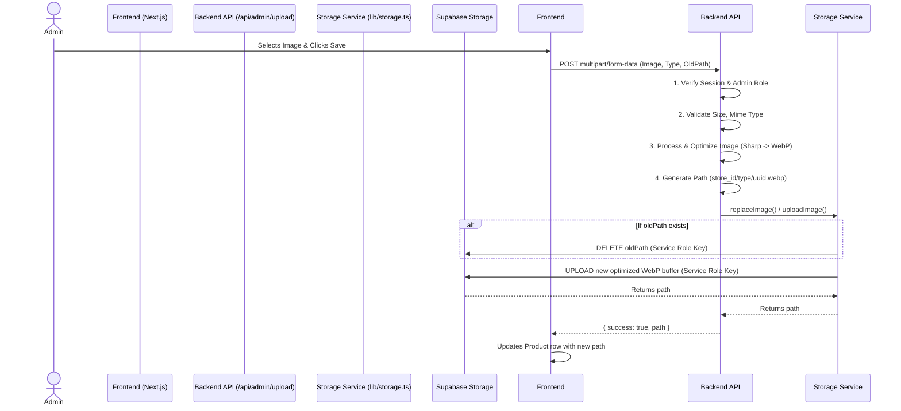

# The 2AM Club - System Architecture

This document outlines the core architecture of The 2AM Club, specifically focusing on the multi-tenant store model and the secure storage subsystem.

## Core Architecture
The platform is designed to support multiple tenants (Organizations), each containing multiple physical locations (Stores). Authentication is handled via standard Supabase Auth, with role-based access control managed through a mapping table (`store_members`).

- **Global Entities:** `organizations`
- **Tenant Entities:** `stores` (belong to organizations)
- **Scoped Entities:** `products`, `orders`, `order_items`, `audit_logs`, `invitation_codes` (all strictly belong to a specific `store_id`)
- **Authentication:** Users authenticate via standard Supabase Auth. Upon signup, a database trigger automatically creates a corresponding row in the `profiles` table.
- **Authorization:** Permissions are managed via Row Level Security (RLS) policies based on two factors:
  1. `SUPER_ADMIN` role embedded in the user's profile for full platform access.
  2. `store_members` mapping for Store Admins (`STORE_OWNER`, `STORE_MANAGER`, `STAFF`) scoped to specific stores.

## Storage Subsystem (Secure Production Mode)

To ensure high security, the storage architecture completely isolates the public frontend from direct upload/delete access.

### Security Principles:
1. **Public Read-Only:** The `product-images` bucket only allows `SELECT` operations for `anon`. No `INSERT/UPDATE/DELETE` policies exist for the public.
2. **Server-Side Uploads:** All uploads are routed through a Next.js Server API (`/api/admin/upload`) using the `Service Role` key to bypass RLS.
3. **Session Verification:** The API strictly verifies the user's authenticated session and roles before proceeding.
4. **Image Optimization:** All uploaded images are processed using `sharp` (Max 1600px, WebP format, Max size 2MB).

### Upload Sequence Diagram

## Idempotent Database Migrations

The database is initialized via standard Supabase Migrations (`supabase/migrations/`).
- `00000000000000_init.sql` establishes the schema, triggers, and base tables.
- `20260713170000_enterprise_audit_fixes.sql` configures explicit role privileges and highly isolated RLS policies.
- RLS evaluation leverages `SECURITY DEFINER` helper functions (`is_super_admin`, `is_store_member`) to securely and efficiently determine permissions without infinite recursion.
